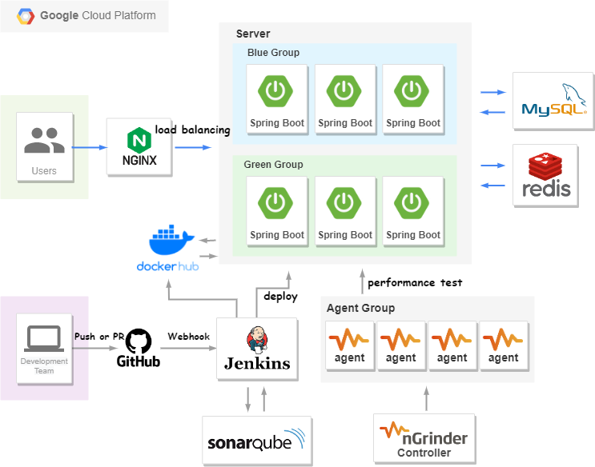
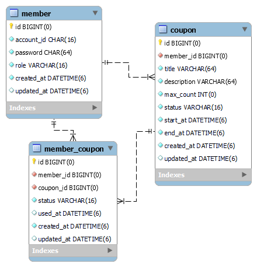
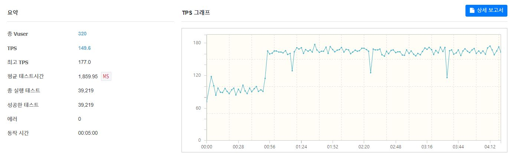
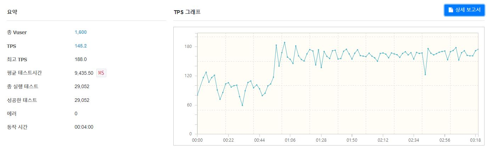
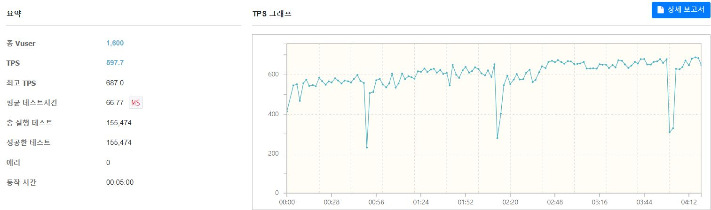
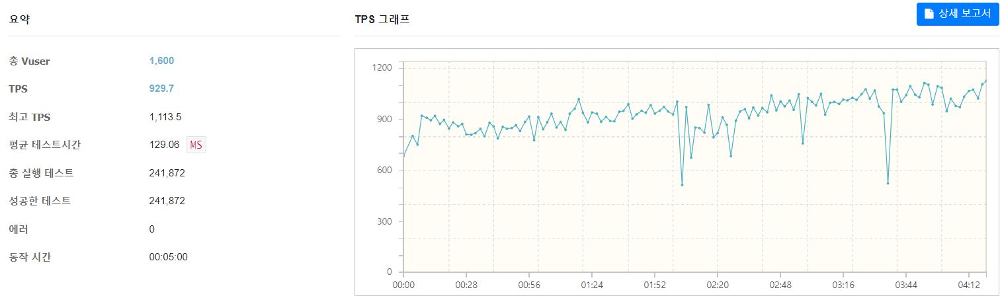

# 선착순 쿠폰 발급 API
개요
 - 수강 신청, 선착순 쿠폰 이벤트, 티켓 예매, 예약 시스템 등 특정 시간에 트래픽이 몰리는 상황과 동시성을 고려한 서비스 개발이 궁금해서 시작한 프로젝트 

 

내용

 - 판매자 권한을 가진 유저가 쿠폰 정보를 등록하면 일반 유저는 한정된 개수를 가진 쿠폰에 대해 다운로드 요청을 해서 쿠폰을 발급받는 시나리오를 가정하여 개발
- 선착순 쿠폰 이벤트 특성상 순간 몰리는 트래픽에 대응하여 서버가 Auto Scaling 되기 전에 이벤트가 끝날 수도 있으므로 서버의 대수를 미리 늘리고 감당할 수 있는 트래픽을 측정하는 것이 중요하다고 생각해 nGrinder를 학습해 성능테스트 진행
- Redis를 활용하여 쿠폰 개수 동시성 이슈 처리

 

쿠폰 개수 동시성 이슈 처리

1. 기존 방법 
   - Redisson 클라이언트의 분산 락을 활용하여 처리
- 락을 획득한 동안 쿠폰 발급 요건사항 체크와 조건 만족시 쿠폰을 실제로 지급하는 로직 실행
   - 쿠폰 개수에 대해서만 redis에 저장해서 발급 가능한 쿠폰 개수를 체크하고 member_coupon 테이블을 조회하여 중복 발급 여부를 확인함
   - 조건 만족시 유저에게 실제로 쿠폰을 지급(MySQL member_coupon 테이블에 유저 쿠폰 정보 저장)하는 로직 실행
   
2. 변경 방법
   - Redis의 Lua Script를 활용하여 쿠폰 발급 요건사항 체크와 쿠폰 지급 대상 마킹 로직을 atomic하게 처리
     - 쿠폰 개수 외에도 쿠폰 발급 요건사항에 대한 체크를 redis 내에서 처리해서 더 빠르게 로직이 실행될 수 있게 변경
     - 선착순 쿠폰 지급 대상 마킹은 쿠폰 발급 요건을 충족한 유저를 Set 타입에 저장하고 Sorted Set 타입에 유저에게 실제로 발급할 쿠폰 id 를 저장
   - 이후 스케줄러가 돌면서 Redis의 Sorted Set 타입`issuable_coupon_queue`에서 데이터를 가져와 유저에게 실제로 쿠폰을 지급(MySQL member_coupon 테이블에 유저 쿠폰 정보 저장)

 

## 프로젝트 구조

## DB 구조

## 사용한 기술 스택

- Kotlin, Kotest, Mockk
- Spring Boot, Spring Security, Spring Data JPA, Spring Data Redis
- MySQL, Redis, nGrinder, GCP
- Jenkins, JaCoCo, SonarQube

 

## 성능 테스트

여러대의 API 서버로 부하 분산 중인 상황에서 선착순 쿠폰 다운로드 요청 성능 테스트

### 준비

1. 테스트를 위한 더미 데이터 설정
   - 미리 각 테이블 member 100만, coupon 10만, member_coupon 1000만개의 더미 데이터 저장

2. 선착순 이벤트 특성상 유저가 이미 로그인이 완료된 상태에서 쿠폰 다운로드 요청을 보낼 것이라 생각하고 테스트 시나리오를 가정
   - 미리 Access Token 10만 개 설정(유효하지 않은 토큰, 만료된 토큰인 경우들 제외)
   - 설정한 Access Token을 1만개씩 csv 파일 10개로 나눈 후 agent의 pid 기준으로 10개 중 하나 설정하여 요청
   - 할당된 Access Token 정보를 가진 csv 파일 내의 유저 정보 중 랜덤하게 선택해서 다운로드 요청(한 명이 여러 번 요청하는 경우도 있으니 테스트가 진행되는 중에는 계속 랜덤하게 유저 정보 택해서 요청함)

 

### 서버 사양

- API 서버 (1대당 사양 : vCPU 2 Core RAM 4GB )

- MySQL 서버 1대 (vCPU 2 Core Ram 8GB)

- Redis 서버 1대 (vCPU 2 Core Ram 8GB)

- Ngrinder Controller 1대 (vCPU 2 Core RAM 4GB)

- Ngrinder Agent 총 4대 (1대당 사양 : vCPU 2 Core RAM 4GB)

 

### 테스트 결과

#### 1. 기존 방법 (Redisson Lock 사용)

1. API 서버 2대 (vuser = 320, coupon count = 5000)

2. API 서버 2대 (vuser = 1600, coupon count = 5000)

- 남은 쿠폰이 존재해서 쿠폰 다운 로드 요청이 처리될 때 TPS 60 ~ 120, 쿠폰이 모두 소진된 후 들어오는 요청 처리 시 TPS 140 ~ 180 정도 측정됨
- 생각보다 TPS가 적게 나왔다고 생각, 분산 락을 활용하는 방법이 아닌 Redis가 싱글 스레드 기반으로 커맨드를 처리하는 점을 활용하여 쿠폰 개수 감소 로직을 처리하는 방향으로 다운로드 로직을 수정하는 것이 더 나은 방법일 수도 있다고 생각됨
- 쿠폰을 다운로드할 수 있는 조건에 부합해서 DB(MySQL)에 실제 쿠폰을 지급하는 Insert Query가 선착순 쿠폰 다운로드 API의 비즈니스 로직 내에 포함되어 있는데 실제로 쿠폰을 지급하는 로직은 따로 Queue에 쌓아서 Consumer에서 처리하는 것이 성능과 안전성 면에서 더 좋지 않을까 생각됨

 

#### 2. 개선 방법

- 선착순 쿠폰 다운로드 요청과 다운로드 요건을 충족한 유저들에게 쿠폰을 실제로 지급하는 로직 분리한 방법

1. API 서버 2대 (vuser = 1600, coupon count = 5000)

 

2. API 서버 4대 (vuser = 1600, coupon count = 5000)

- 기존 방법보다 TPS가 더 높고 API 서버를 2대에서 4대로 늘렸을 때 TPS가 상승한 것을 볼 수 있었다

