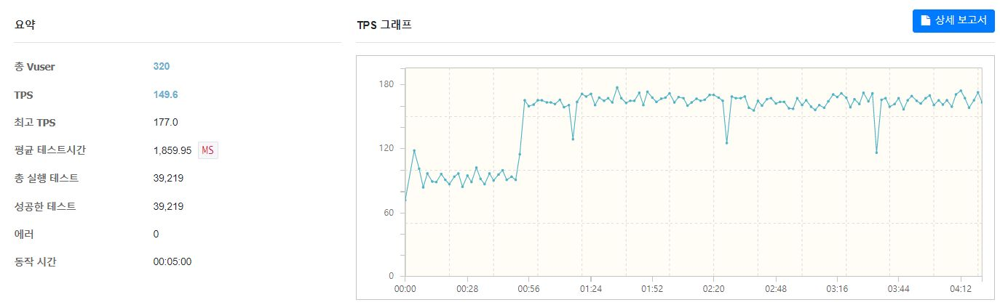
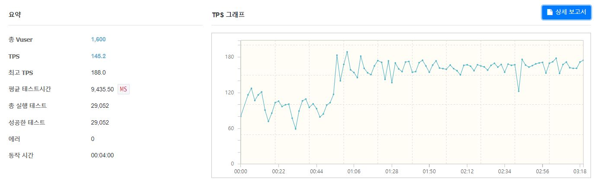

# 선착순 쿠폰 발급 API

- 수강 신청, 예약 시스템, 선착순 쿠폰 이벤트 등 다수의 사용자가 동시에 한정된 자원에 접근하려 하고, 짧은 시간 동안 트래픽이 몰릴 수 있는 서비스 개발이 궁금해서 시작한 프로젝트
- 판매자처럼 특정 권한을 유저가 쿠폰 정보(개수나 기간)를 등록하면 일반 유저는 한정된 개수를 가진 쿠폰에 대해 다운로드 요청을 해서 발급받는 시나리오를 가정하여 개발

 

## 프로젝트 구조

## DB

## 기술 스택

- Kotlin, Kotest, Mockk
- Spring Boot, Spring Security, Spring Data JPA
- Mysql, Redis(redisson), Ngrinder, GCP
- Jenkins, JaCoCo, SonarQube

 

## 성능 테스트

API 서버 2대로 부하 분산 중인 GCP 로드밸런서로 요청하여 쿠폰 다운로드 기능 성능 테스트 

- Test를 위한 dummy data table별로 member 50만, member_coupon 500만, coupon 1만 개 넣어두고 테스트 중

### 서버 사양

- API 서버 2대 - 4vCPU RAM 8GB 

- MySQL 서버 1대 - 2vCPU Ram 8GB

- Redis 서버 1대 - 2vCPU Ram 8GB

- Ngrinder Controller 1대 - 2vCPU RAM 4GB

- Ngrinder Agent 4대 - 2vCPU RAM 4GB

 

1. vuser = 320, coupon count = 5000

2. vuser = 1600, coupon count = 5000

남은 쿠폰이 있을 때 쿠폰 다운로드 요청은 TPS 100 정도

쿠폰이 모두 소진된 후 들어오는 요청을 처리할 때는 TPS가 170정도 나온다

