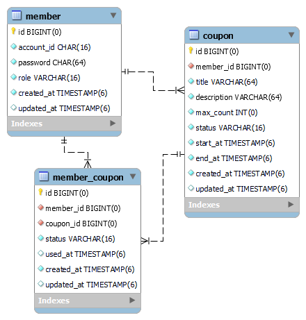

# 선착순 쿠폰 발급 API

- 수강 신청, 예약 시스템, 선착순 쿠폰 이벤트 등 짧은 시간에 트래픽이 몰릴 수 있는 서비스 개발이 궁금해서 시작한 프로젝트

- 판매자처럼 특정 권한을 유저가 쿠폰 정보(개수나 기간)를 등록하면 일반 유저는 한정된 개수를 가진 쿠폰에 대해 다운로드 요청을해서 발급받는 시나리오를 가정하여 개발

 

## 프로젝트 구조

 

## DB

 

## 기술 스택

- Kotlin, Kotest, Mockk

- Spring Boot, Spring Security, Spring Data Jpa

- Mysql, Redis(redisson), Ngrinder, GCP

- Jenkins, Jacoco, Sonarqube